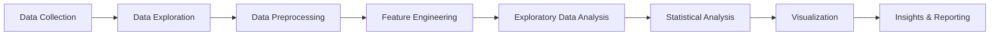

# 📊 Student Exam Scores Analysis


## 📝 Project Summary

This data science project analyzes student exam performance across math, reading, and writing subjects to identify key factors influencing academic success. By examining 30,641 student records with 14 diverse features including demographic information, socio-economic indicators, and study habits, the analysis reveals actionable insights for educators and policymakers to improve educational outcomes through targeted interventions and personalized learning strategies.

---

## 🎯 Motivation / Problem Statement

Academic performance is influenced by a complex interplay of personal, demographic, and socio-economic factors. This project addresses the critical challenge of understanding **which factors most significantly impact student test scores** and whether there are interaction effects between different variables.

**Key Questions:**

- How do demographic factors (gender, ethnicity) correlate with academic performance?
- What role do socio-economic factors (lunch type, parental education) play in student success?
- Does test preparation or sports participation improve scores?
- Are there patterns in study habits that lead to better outcomes?

By answering these questions, this analysis provides data-driven recommendations for educational resource allocation and student support programs.

---

## 📁 Dataset Description

**Source:** [Students Exam Scores - Kaggle](https://www.kaggle.com/datasets/desalegngeb/students-exam-scores/data)

**Dataset Size:**

- **Rows:** 30,641 student records
- **Columns:** 14 features
- **Files:**
  - `Expanded_data_with_more_features.csv` (main dataset)
  - `Original_data_with_more_rows.csv` (reference dataset)

**Key Features:**
| Feature | Description | Type |
|---------|-------------|------|
| `Gender` | Student gender (male/female) | Categorical |
| `EthnicGroup` | Ethnic group classification (A to E) | Categorical |
| `ParentEduc` | Parent education level | Categorical |
| `LunchType` | School lunch type (standard/free-reduced) | Categorical |
| `TestPrep` | Test preparation course status | Categorical |
| `ParentMaritalStatus` | Marital status of parents | Categorical |
| `PracticeSport` | Sports participation frequency | Categorical |
| `IsFirstChild` | First child status in family | Binary |
| `NrSiblings` | Number of siblings (0-7) | Numerical |
| `TransportMeans` | Transportation to school | Categorical |
| `WklyStudyHours` | Weekly self-study hours | Categorical |
| `MathScore` | Math test score (0-100) | Numerical |
| `ReadingScore` | Reading test score (0-100) | Numerical |
| `WritingScore` | Writing test score (0-100) | Numerical |

---

## 🛠️ Tools & Technologies

**Programming Language:**

- Python 3.8+

**Core Libraries:**

```python
├── Data Manipulation
│   ├── pandas
│   └── numpy
├── Visualization
│   ├── matplotlib
│   ├── seaborn
│   └── plotly (potential)
├── Statistical Analysis
│   └── scipy (implied)
└── Development Environment
    └── Jupyter Notebook
```

**Environment:**

- Jupyter Notebook
- Virtual Environment (venv)
- Git/GitHub for version control

---

## 🔄 Project Architecture / Workflow



### Detailed Pipeline:

1. **Data Loading & Exploration**

   - Load CSV datasets
   - Initial data inspection (`.info()`, `.describe()`)
   - Identify data types and missing values

2. **Data Preprocessing**

   - **Missing Value Treatment:** Mode imputation for categorical variables
   - **Duplicate Removal:** Cleaned duplicate records
   - **Data Type Conversion:** Transformed `WklyStudyHours` ranges to numerical values
   - **Feature Engineering:** Created `avg_score` column (mean of all three subjects)

3. **Exploratory Data Analysis (EDA)**

   - Distribution analysis of test scores
   - Demographic breakdowns (gender, ethnicity, parental education)
   - Correlation analysis using heatmaps
   - Comparative analysis across 15+ research questions

4. **Visualization & Insights**
   - Count plots for categorical distributions
   - Bar plots for average score comparisons
   - Heatmaps for correlation matrices
   - Pie charts for pass rate analysis

---

## ✨ Key Features & Achievements

### 🔍 **Comprehensive Analysis:**

- **15+ Research Questions** explored systematically
- **30,641 student records** analyzed
- **Multi-dimensional insights** across demographics, socio-economics, and study habits

### 📈 **Key Findings:**

1. **Ethnic Group E** shows the highest average test scores across all subjects
2. **Parental Education** has a strong positive correlation with student performance
   - Students with parents holding master's degrees score ~15% higher on average
3. **Test Preparation Completion** improves scores by approximately 10-12 points
4. **Standard Lunch Type** students outperform free/reduced lunch students
5. **Weekly Study Hours** show positive correlation with academic performance
6. **Pass Rate Analysis:**
   - Math: ~88% pass rate (>50%)
   - Reading: ~93% pass rate
   - Writing: ~91% pass rate
7. **High Achievers:** ~23% of students score above 80% in all three subjects
8. **Strong Correlation** between Reading and Writing scores (r > 0.9)

### 🎨 **Visualizations:**

- Correlation heatmaps with 9+ variables
- Distribution plots for test scores
- Comparative bar plots across demographic groups
- Pass rate pie charts and bar graphs

---

## 💻 Installation Instructions

### Prerequisites

- Python 3.8 or higher
- pip package manager

### Setup Steps

1. **Clone the repository:**

   ```bash
   git clone https://github.com/MoatazMahmoud404/student-exam-scores-analysis.git
   cd student-exam-scores-analysis
   ```

2. **Create a virtual environment:**

   ```bash
   python -m venv venv
   ```

3. **Activate the virtual environment:**

   - **Windows:**
     ```bash
     venv\Scripts\activate
     ```
   - **macOS/Linux:**
     ```bash
     source venv/bin/activate
     ```

4. **Install required packages:**

   ```bash
   pip install -r requirements.txt
   ```

   If `requirements.txt` is not available, install manually:

   ```bash
   pip install pandas numpy matplotlib seaborn jupyter ipykernel
   ```

5. **Register the kernel (for Jupyter):**
   ```bash
   python -m ipykernel install --user --name=venv
   ```

---

## 🚀 Usage Instructions

### Running the Analysis

1. **Launch Jupyter Notebook:**

   ```bash
   jupyter notebook
   ```

2. **Open the main notebook:**

   - Navigate to `Student Exam Scores Analysis.ipynb`
   - Select the `venv` kernel if prompted

3. **Run the analysis:**
   - Execute cells sequentially from top to bottom
   - Review outputs, visualizations, and insights

### Key Sections in the Notebook:

- **Section 1-2:** Library imports and data loading
- **Section 3:** Data exploration and profiling
- **Section 4:** Data preprocessing and cleaning
- **Section 5:** Feature engineering
- **Section 6:** Visualization and analysis
- **Section 7:** 15 research questions with answers

---

## 📊 Results & Visualizations

### Sample Visualizations:

**1. Test Score Distribution**

- Histogram showing the distribution of Math, Reading, and Writing scores
- All three subjects show near-normal distributions with slight right skew

**2. Correlation Heatmap**

- Strong positive correlation between Reading and Writing scores
- Moderate correlation between parental education and test scores
- Test preparation shows positive correlation with all subjects

**3. Demographic Analysis**

- Gender distribution: Relatively balanced dataset
- Ethnic group E shows highest performance; Group A shows lowest
- Parental education level strongly influences outcomes

**4. Pass Rate Analysis**

- Overall pass rate: >88% across all subjects
- 23% of students achieve excellence (>80% in all subjects)

**5. Socio-Economic Impact**

- Standard lunch students score 12-15 points higher on average
- Weekly study hours correlate positively with performance
- Sports participation shows minimal negative impact

---

## 📂 Project Structure

```
student-exam-scores-analysis/
│
├── Student Exam Scores Analysis.ipynb    # Main Jupyter notebook
├── Expanded_data_with_more_features.csv  # Primary dataset
├── Original_data_with_more_rows.csv      # Reference dataset
├── README.md                              # Project documentation
├── requirements.txt                       # Python dependencies (to be created)
└── venv/                                  # Virtual environment (local only)
```

---

## 🔮 Future Work / Improvements

### Planned Enhancements:

1. **Machine Learning Models**

   - Build predictive models (Linear Regression, Random Forest, XGBoost)
   - Predict student scores based on demographic and socio-economic features
   - Feature importance analysis using model interpretability tools

2. **Advanced Statistical Analysis**

   - ANOVA tests for group comparisons
   - Chi-square tests for categorical associations
   - Multiple regression analysis for interaction effects

3. **Interactive Dashboards**

   - Create Plotly/Dash interactive visualizations
   - Build Streamlit web application for dynamic exploration
   - Enable filtering by demographic groups

4. **Time Series Analysis** (if temporal data available)

   - Track performance trends over academic years
   - Seasonal patterns in test scores

5. **Recommendation System**

   - Develop personalized study recommendations
   - Risk assessment for students needing intervention

6. **A/B Testing Framework**
   - Design experiments to test intervention effectiveness
   - Statistical validation of educational strategies

---

## 📈 Project Stats


---

**⭐ If you find this project helpful, please consider giving it a star!**
